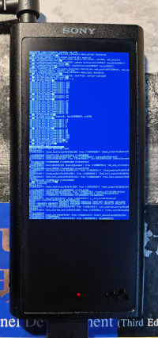

## panic2screen: Dump panic message to screen

* For Sony NW-ZX300 only
* Useful for debugging kernel code
* Configurable display style & reboot behaviour

### Example

### Config macros

* `DUMP_ALL_KMSG`
    * `1` = Dump all kmsgs
    * `0` = Dump only kmsgs related to panic
* `DUMP_TRACE`
    * `1` = Show stack trace when panic
    * `0` = Hide stack trace when panic
* `FEED_WATCHDOG`
    * `1` = Disable auto-reboot
    * `0` = Enable auto-reboot
* `BG_COLOR`
    * `0xFF0000FF` = Blue background (BSOD style)
    * `0xFF000000` = Black background
* `FG_COLOR`
    * `0xFFFFFFFF` = White foreground
