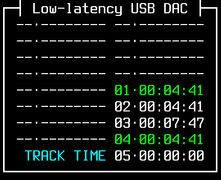
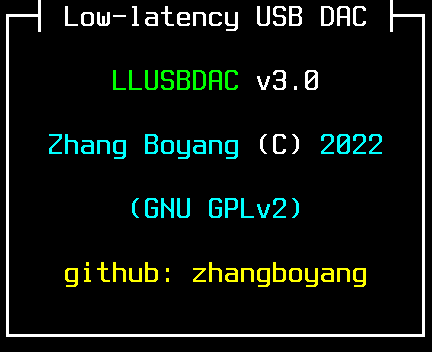

# LLUSBDAC User Guide

## Features

LLUSBDAC can change your NW-ZX300A as a USB sound card. The overall latency is about 50 milliseconds. It can also show infomation while playing audio, like sample rate, bit depth, CRC32 checksum, etc. Only PCM audio is supported, DSD audio is not supported.

Installer only supports Windows operating system. However, after installation into the device, it can work without Windows. Supported operating systems are:

* Windows 10, 1703 or higher
* macOS, iOS, iPadOS
* Linux

## Installation

1. Download `NW-ZX300_V2_02.exe` from [sony website](https://www.sony.com/electronics/support/digital-music-players-nw-nwz-zx-series/nw-zx300/downloads/00016328), put it along with `llusbdac_installer.exe`.
2. Connect your device to a computer as "USB mass storage device".
3. Run `llusbdac_installer.exe` and follow instructions on screen.

## Usage

After installation, LLUSBDAC is disabled by default. To enable LLUSBDAC, please switch your device to USB DAC mode. Then press one of physical button "⏮", "⏯", "⏭", three times. After startup, LLUSBDAC will show its user interface. Please connect your device to your computer. The computer will automatically detect a sound card with "LLUSBDAC" in its name, no additional driver is needed.

After enabled, LLUSBDAC will keep working. To disable it, please reboot your device.

## Interface

LLUSBDAC will display information while working. You can use physical button "⏮", "⏯", or "⏭" to switch page. The meaning of each page is:

|Sample|Meaning|
|-|-|
||`STATE`: Current state<br>`FORMAT`: Sample rate, bit depth<br>`TIME`: Audio length<br>`SAMPLE`: Audio frames<br>`CRC32`: Checksum<br>`BUFFER`: Buffer time<br>`ERROR`: Count of detected errors|
||CRC32 checksum of detected tracks<br>Duplicate items are in green<br>Error items are in red|
||Audio length of each track<br>The color meaning is same as last page|
||Software version, license information, etc.|

## Checksum Tool

LLUSBDAC's CRC32 checksum is different from other softwares. It trimmed silent samples from calculation. You can use `audio_crc32.exe` to calculate such checksums: 

1. Download [ffmpeg](https://www.ffmpeg.org/download.html), put `ffmpeg.exe` along with `audio_crc32.exe`
2. Drag your audio files (or folders) onto the icon of `audio_crc32.exe`
3. A window with calculation progress will show up. It will show results as a table after calculation completed.

Sample results:

```
--------------+-------------------------------------------+-----------------
     TIME     |     S16LE        S24_3LE        S32LE     |      FILE
--------------+-------------------------------------------+-----------------
 00:04:41.787 |  16:c08f2dfc  [24:E805E786] [32:D855963E] | 0012078980.flac
 00:04:41.789 |  16:9424690a  [24:793B394A] [32:F4EC9102] | 0012078981.flac
 00:07:47.040 |  16:94273ba3  [24:4A61B034] [32:189F5CAD] | 0012078982.flac
--------------+-------------------------------------------+-----------------
```

* `TIME`: Length of audio after trimming
* `S16LE`, `S24_3LE`, `S32LE`: The checksum value after converting audio to 16, 24 or 32 bits. Lossless convert is shown as uppercase with brackets. Lossy convert is shown as lowercase without brackets.
* `FILE`: File name of audio file

## Source code

This program is released under GPLv2. You can get the source code from [GitHub](https://github.com/zhangboyang/llusbdac).
