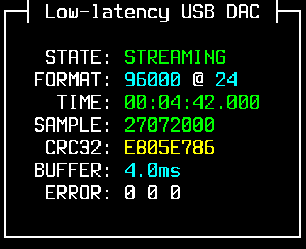

# LLUSBDAC 使用说明

## 功能说明

&emsp;&emsp;LLUSBDAC 可以使 NW-ZX300A 作为 USB 外接声卡，以相对较低的延迟（约为 50 毫秒）输出声音。此外还可显示音频相关信息，如采样率、位深度、CRC32 校验和等。本软件只支持 PCM 格式音频，不支持 DSD 格式音频。

&emsp;&emsp;安装工具仅支持 Windows 系统，但成功安装到设备中后，后续使用过程无须 Windows 系统。使用时支持的系统如下：

* Windows 10, 1703 版本或更高
* macOS, iOS, iPadOS
* Linux

## 安装方法

1. 从[索尼网站](https://service.sony.com.cn/download/firm/00002817.html)上下载 `NW-ZX300_V2_02.exe`，将它与 `llusbdac_installer.exe` 放置于同一目录下；
2. 将设备以“USB 大容量存储”模式连接至计算机；
3. 运行 `llusbdac_installer.exe`，然后按屏幕指示操作即可。

## 使用方法

&emsp;&emsp;安装后 LLUSBDAC 默认处于禁用状态。要使用 LLUSBDAC，请将设备调至 USB DAC 状态后，连按三次物理按钮“⏮”、“⏯”、“⏭”中任意一个。启用后， LLUSBDAC 会在屏幕上覆盖显示图形界面。此时请将设备连接至计算机，计算机会自动识别到标有 LLUSBDAC 字样的声卡，无须安装任何额外驱动程序。

&emsp;&emsp;启用 LLUSBDAC 后，它会一直处于工作状态。若要禁用 LLUSBDAC，只需将播放器设备关机、重新启动即可。

## 界面说明

&emsp;&emsp;在 LLUSBDAC 运行过程中，可按物理按钮“⏮”、“⏯”、“⏭”切换页面。每个页面显示的信息的含义如下：

|页面示例|含义|
|-|-|
||`STATE`：当前状态<br>`FORMAT`：音频采样率、位深度<br>`TIME`：音频时长<br>`SAMPLE`：音频样本数<br>`CRC32`：数据校验和<br>`BUFFER`：缓冲时长<br>`ERROR`：检测到的错误数|
||已检测出的音轨的 CRC32 校验和<br>重复项以绿色显示<br>错误项以红色显示|
||上一页中的对应音轨的时长<br>颜色的意义与上一页相同|
||软件版本、许可证等信息|

## 校验和计算工具

&emsp;&emsp;LLUSBDAC 显示的 CRC32 校验和，与一般软件不同，计算时剔除了音频前后的无声音部分。可以使用随附的 `audio_crc32.exe` 计算音频文件的校验和。使用方法如下：

1. 下载 [ffmpeg](https://www.ffmpeg.org/download.html)，并将其中的 `ffmpeg.exe` 与 `audio_crc32.exe` 放置在同一目录下；
2. 将待计算的音频文件（文件夹）用鼠标拖放到 `audio_crc32.exe` 的图标上；
3. 拖放后会弹出显示计算进度的窗口，计算完毕后，计算结果会以表格形式显示在窗口中。

&emsp;&emsp;计算结果示例：

```
--------------+-------------------------------------------+-----------------
     TIME     |     S16LE        S24_3LE        S32LE     |      FILE
--------------+-------------------------------------------+-----------------
 00:04:41.787 |  16:c08f2dfc  [24:E805E786] [32:D855963E] | 0012078980.flac
 00:04:41.789 |  16:9424690a  [24:793B394A] [32:F4EC9102] | 0012078981.flac
 00:07:47.040 |  16:94273ba3  [24:4A61B034] [32:189F5CAD] | 0012078982.flac
--------------+-------------------------------------------+-----------------
```

* `TIME`：剔除静音后的音频时长
* `S16LE`、`S24_3LE`、`S32LE`：将音频转换至 16、24、32 位时，对应的 CRC32 校验和的值；无损转换以大写和方括号标出，有损转换以小写和无括号标出
* `FILE`：音频文件的文件名

## 源代码

&emsp;&emsp;本程序以 GPLv2 许可证发布，源代码可从 [GitHub](https://github.com/zhangboyang/llusbdac) 上获得。
